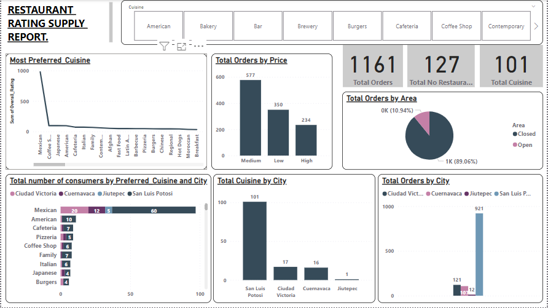

# Restaurant-Rating-Report

## INTRODUCTION

This rating report is about restaurants in Mexico it contains data information about their services, the dataset was obtained by carrying out a customer survey in 2012 aiming to gather information about each restaurant, cuisines, customers preference and other basic information about their customers.

## DATA SOURCING
Link to the dataset [here] (https://drive.google.com/file/d/1c1HKM8UTqwWOgexRLOtEJuxjBiA2N6xf/view?usp=drive_link)

## PROBLEM STATEMENT
The primary objective of this report is to gain insights into customer behavior through the analysis of purchase history, understand customer satisfaction levels, inform market strategies, and provide guidance for future investments. By scrutinizing this dataset, we aim to obtain a deeper understanding of the competitive market landscape and customer preferences. The dataset encompasses information from 127 restaurants located in four cities across Mexico.
The report will address the following key questions:
1. What insights can be gleaned from the highest-rated restaurants, and is there a correlation between consumer preferences and ratings
2. What are the demographics of the consumers in the dataset, and does this information suggest any biases in the sample?
3. Are there any discernible gaps in demand and supply within the market that could be leveraged?
4. For potential restaurant investments, what characteristics should be prioritized?
   
## DATA PREPARATION
The dataset comprises five tables: consumer preference, consumers, ratings, restaurants, and cuisine. These tables contain various columns providing information on headers. To address data inconsistencies, empty cells were replaced with 'N/A-Not Available,' duplicates were removed, and new columns were created, renamed, and adjusted. For instance, a conditional column was added to categorize the age column under the consumer's table. The rating table serves as the fact table in this dataset.

Queries were applied to modify the original dataset, establishing connections between the five tables through one-to-many relationships. Additionally, Data Analysis Expression Language (DAX) was employed to enhance the dataset. Calculated columns, such as Total number of Restaurants, Total number of Cuisines, and Total number of Customers, were introduced as new measures and organized into a separate table titled "Dax Measures." These measures contribute to providing valuable insights.

## DATA MODELLING
This data was modelled using one to many relationship because of the prescence of foriegn keys.

## VISUALIZATION AND ANALYSIS
To address the outlined questions, I employed various charts, cards, and graphs, creating four distinct reports. Each report is dedicated to one of the broad questions posed, providing a detailed analysis.

Report 1

•	A restaurant can actually serve more than one cuisine indicating versatility

•	The top 3 restaurants are Tortas Locas Hipocampo, Puesto De Tacos and Caffeteria Restaurant El pacific.

•	Tortas Locas Hipocampo, the highest-rated restaurant, received praise for its food, services, and overall experience. It had the most ratings and the highest number of orders (36).

•	Mexican cuisine holds top preference exerting a significant influence on restaurant due to its consistently high rating compared to other restaurants.

Report 2

 The consumer demographics in this data set includes Age, City, Transportation Method, Children, Drink Level, Occupation and Marital Status.
 
 
 
 The age less than 35 was categorized as young, otherwise as old.
 
•	The young people below (35) predominantly have a medium budget size.

•	 San Luis Potosi has the highest consumer percentage 62.3%.

•	Maximum customers use public transportation method.

•	Majority of the consumers are independent and a significant portion are students indicating bias towards certain demographics

Report 3

Titled “Supply” this report examines demand and supply gaps.

•	San Luis Potosi has the most restaurants (81 out of 127), suggesting higher demand

•	The most demanded and supplied cuisine is the Mexican Cuisine.

•	Closed areas in restaurants and those offering medium prices are in high demand.

Report 4

Focuses on key characteristics for potential restaurant investment.

•	The survey respondents value restaurants without alcohol service, independent establishment(non-franchise), and those with a no smoking policy.

•	50.78% of the restaurants has no parking space but it hasn’t affected business.

•	Restaurants in San Luis Potosi stands out as a key investment location in Mexico.

## CONCLUSION AND RECOMMENDATION

The insights gathered from the reports provide valuable information for understanding customer behavior, preferences, and market dynamics in the restaurant industry in Mexico. These findings can guide strategic decisions, marketing approaches, and potential investments, emphasizing the significance of factors such as cuisine offerings, consumer demographics, and location-specific considerations. The comprehensive analysis aids in drawing informed conclusions for maximizing opportunities and addressing challenges within the Mexican restaurant market.

